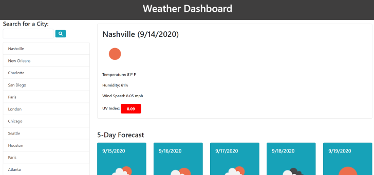
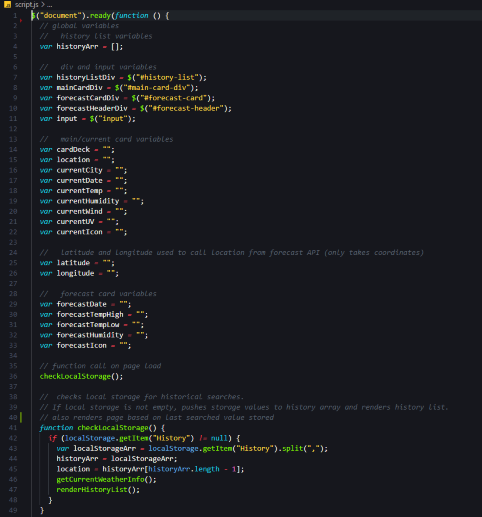
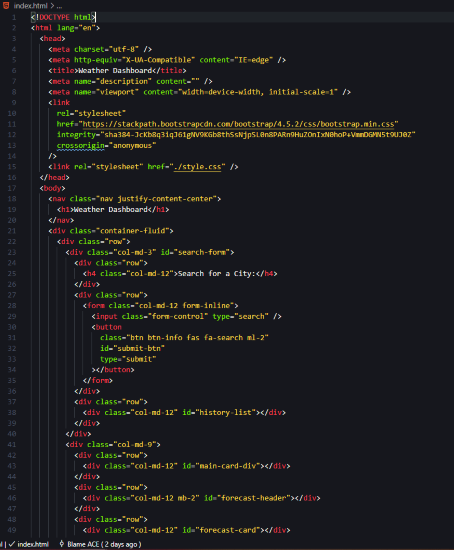

# WEATHER DASHBOARD

The purpose of this repository is to create a weather dashboard where someone can research the current weather and 5 day forecast for a selected city.

-----

## Table of Contents
* [Installation](#installation)
* [Usage](#Usage)
* [Building the Weather Dashboard](#building-the-weather-dashboard)
* [Acceptance Criteria](#acceptance-criteria)
* [Credits](#credits)
* [Contact](#contact)
* [Badges](#badges)
* [Links](#Links)
* [License](#license)

-----

## Installation
1. Follow the GitHub Repository Link in the [Links](#Links) section below.
1. Clone the repository using an SSH key.
1. Open GitBash and use "git clone" to clone the repository.

-----

## Usage
Edit using VSCode after [installation](#installation). HTML, JS and CSS files are provided.

#### Javascript and HTML

-----

## Building the Weather Dashboard

When a user enters this dashboard for the first time they will simply see a search form. After entering a city in the search form, upon submit the page will render information on the current weather as well as a five day forecast for the city. The current weather section will display the city name, current date (in that city), weather condition icon, temperature, humidity, wind speed and UV index number. The user will notice that the UV index number is color coded, should they want more information on the color coding the user can click the UV index and will be redirected to a new tab with details about UV indexes and their meanings. The 5-Day Forecast section will show the date, weather condition icon, high and low temperatures, and the humidity for each of the next 5 days respectively.

In addition to displaying the information for the searched city, the page will also add each searched city to a search history list with the most recent searched city first. If the user wishes to see data on a previously searched city, they can click on that city in the list and the data will appear. In addition, if the user refreshes the page the search history will persist and the user will see data for the most recently searched city (top of the search history list).

One of the issues encountered when building this dashboard was that the current date was returned in UNIX format, I utilized the momentJS library to convert the UNIX time stamp to a standard MM/DD/YYYY format. In addition, another issue that I encountered also involved the date. I noticed that when searching cities a full day ahead of my current location that they would still show my current date rather than the current date in that location. After further investigation I found a "timezone_offset" variable in the response object. I discovered that OpenWeatherMap returns dates in the UTC timezone and if this offset number was added to the UNIX value for the date, I would then get the current date/time in my desired location.

One final hurdle that I had to overcome was that the while the Open Weather - One Call API gave me all the weather data I needed for the current and forecasted weather it required latitude and longitude parameters for it's API call rather than using a city name. Since my application required that a user could search by a city name, I utilized the Open Weather - Current Weather Data API first to retrieve the coordinates by city name and then in turn used those coordinates to make a call on the One Call API.

-----

## Acceptance Criteria
  
* GIVEN a weather dashboard with form inputs :heavy_check_mark:
* WHEN I search for a city :heavy_check_mark:
* THEN I am presented with current and future conditions for that city and that city is added to the search history :heavy_check_mark:
* WHEN I view current weather conditions for that city :heavy_check_mark:
* THEN I am presented with the city name, the date, an icon representation of weather conditions, the temperature, the humidity, the wind speed, and the UV index :heavy_check_mark:
* WHEN I view the UV index :heavy_check_mark:
* THEN I am presented with a color that indicates whether the conditions are favorable, moderate, or severe :heavy_check_mark:
* WHEN I view future weather conditions for that city :heavy_check_mark:
* THEN I am presented with a 5-day forecast that displays the date, an icon representation of weather conditions, the temperature, and the humidity :heavy_check_mark:
* WHEN I click on a city in the search history :heavy_check_mark:
* THEN I am again presented with current and future conditions for that city :heavy_check_mark:
* WHEN I open the weather dashboard :heavy_check_mark:
* THEN I am presented with the last searched city forecast :heavy_check_mark:

-----

## Credits
As always, a huge thanks to our instructional staff for all their hard work!

### Resources:

* [w3schools](https://www.w3schools.com)
* [Bootstrap CSS](https://getbootstrap.com/)
* [jQuery](https://jquery.com/)
* [Moment.js](https://momentjs.com/)
* [Open Weather API - Current Weather](https://openweathermap.org/current)
* [Open Weather API - One Call API](https://openweathermap.org/api/one-call-api)
* [EPA - UV Index Scale](https://www.epa.gov/sunsafety/uv-index-scale-0)

-----

## Contact
Find me on LinkedIn!
[Aimee Esler](https://www.linkedin.com/in/aimee-esler-3bb31288/)

-----

## Badges

-----

## Links
[Repository Link](https://github.com/aimeecesler/weather-dashboard)

[Deployed Application](https://aimeecesler.github.io/weather-dashboard/)

-----

## License
Copyright &copy; [2020] [Aimee Corbin Esler]

Permission is hereby granted, free of charge, to any person obtaining a copy
of this software and associated documentation files (the "Software"), to deal
in the Software without restriction, including without limitation the rights
to use, copy, modify, merge, publish, distribute, sublicense, and/or sell
copies of the Software, and to permit persons to whom the Software is
furnished to do so, subject to the following conditions:

The above copyright notice and this permission notice shall be included in all
copies or substantial portions of the Software.

THE SOFTWARE IS PROVIDED "AS IS", WITHOUT WARRANTY OF ANY KIND, EXPRESS OR
IMPLIED, INCLUDING BUT NOT LIMITED TO THE WARRANTIES OF MERCHANTABILITY,
FITNESS FOR A PARTICULAR PURPOSE AND NONINFRINGEMENT. IN NO EVENT SHALL THE
AUTHORS OR COPYRIGHT HOLDERS BE LIABLE FOR ANY CLAIM, DAMAGES OR OTHER
LIABILITY, WHETHER IN AN ACTION OF CONTRACT, TORT OR OTHERWISE, ARISING FROM,
OUT OF OR IN CONNECTION WITH THE SOFTWARE OR THE USE OR OTHER DEALINGS IN THE
SOFTWARE.
